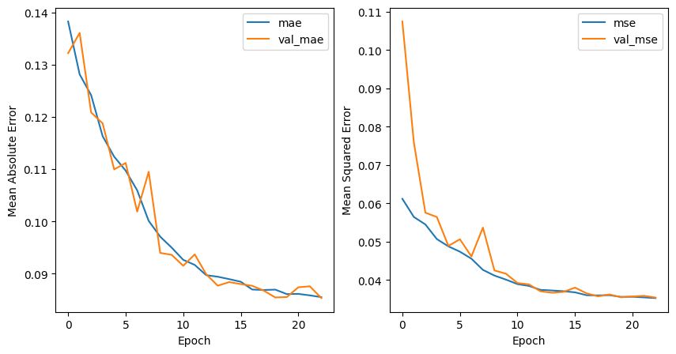
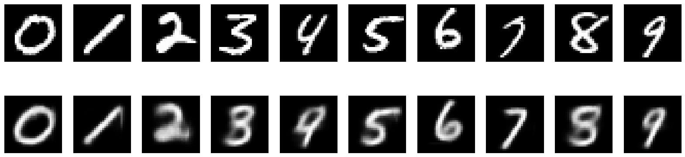
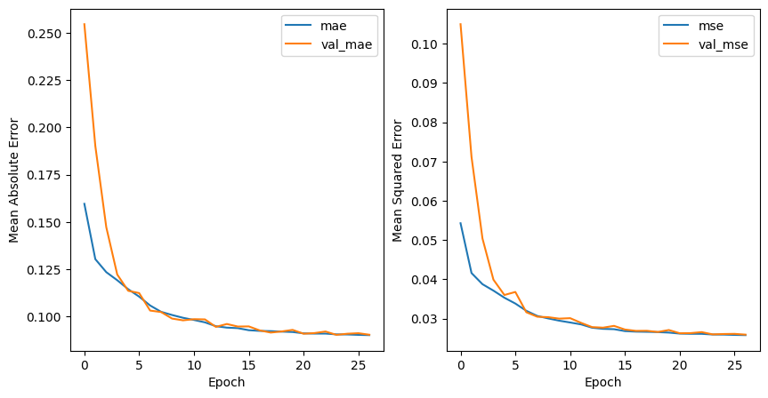
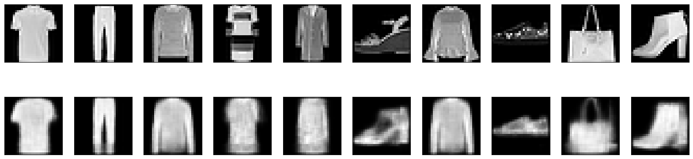
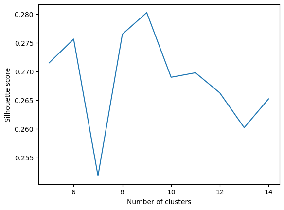
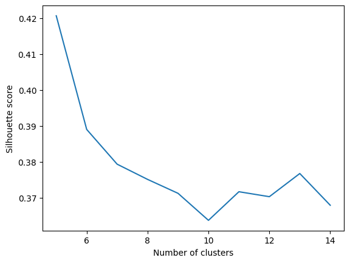
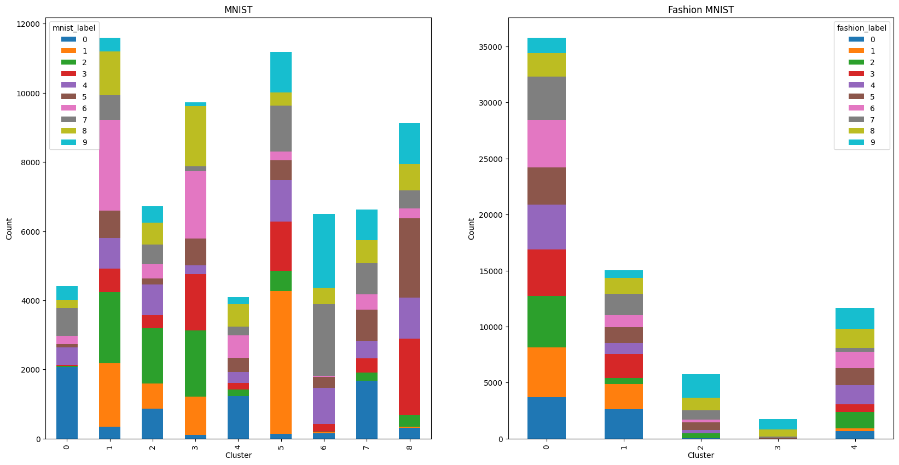
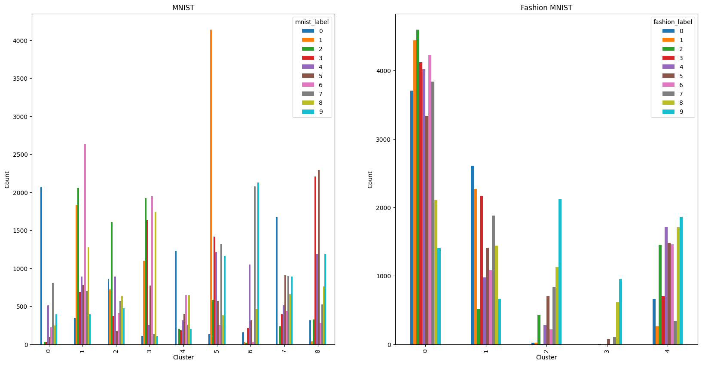

# Auto-Encoder-MNIST

- [Auto-Encoder-MNIST](#auto-encoder-mnist)
  - [Introduction](#introduction)
  - [Datasets](#datasets)
  - [Model](#model)
    - [Encoder](#encoder)
    - [Decoder](#decoder)
  - [Reconstruction](#reconstruction)
    - [MNIST](#mnist)
    - [Fashion MNIST](#fashion-mnist)
  - [Clustering](#clustering)
    - [MNIST](#mnist-1)
    - [Fashion MNIST](#fashion-mnist-1)
  - [Contributors](#contributors)

## Introduction

Auto-Encoder is a type of neural network that is used to reconstruct input data. In this project we tried to build an auto-encoder on MNIST and Fashion MNIST dataset and then use the latent space to do a clustering on MNIST and Fashion MNIST dataset.

## Datasets

For this purpose, we used two famous datasets: [MNIST](https://www.tensorflow.org/datasets/catalog/mnist) and [Fashion MNIST](https://www.tensorflow.org/datasets/catalog/fashion_mnist).

## Model

We used a fully convolutional auto-encoder model with the following architecture:

### Encoder

```text
Model: "model"
________________________________________________________________
 Layer (type)            	Output Shape          	Param #   
================================================================
 input_1 (InputLayer)    	[(None, 28, 28, 1)]   	0    	 
                                                            	 
 conv2d (Conv2D)         	(None, 28, 28, 32)    	320  	 
                                                            	 
 conv2d_1 (Conv2D)       	(None, 28, 28, 32)    	9248 	 
                                                            	 
 max_pooling2d (MaxPooling2D  (None, 14, 14, 32)   	0    	 
 )                                                          	 
                                                            	 
 batch_normalization (BatchN  (None, 14, 14, 32)   	128  	 
 ormalization)                                              	 
                                                            	 
 conv2d_2 (Conv2D)       	(None, 14, 14, 32)    	9248 	 
                                                            	 
 conv2d_3 (Conv2D)       	(None, 14, 14, 32)    	9248 	 
                                                            	 
 conv2d_4 (Conv2D)       	(None, 14, 14, 32)    	4128 	 
                                                            	 
 max_pooling2d_1 (MaxPooling  (None, 7, 7, 32)     	0    	 
 2D)                                                        	 
                                                            	 
 batch_normalization_1 (Batc  (None, 7, 7, 32)     	128  	 
 hNormalization)                                            	 
                                                            	 
 conv2d_5 (Conv2D)       	(None, 7, 7, 16)      	2064 	 
                                                            	 
 conv2d_6 (Conv2D)       	(None, 7, 7, 4)       	260  	 
                                                            	 
 conv2d_7 (Conv2D)       	(None, 7, 7, 1)       	17   	 
                                                            	 
 flatten (Flatten)       	(None, 49)            	0    	 
                                                            	 
 dense (Dense)           	(None, 6)             	300  	 
                                                           	 
================================================================
Total params: 35,089
Trainable params: 34,961
Non-trainable params: 128
________________________________________________________________
```

### Decoder

```text
Model: "model_1"
________________________________________________________________
 Layer (type)            	Output Shape          	Param #   
================================================================
 input_2 (InputLayer)    	[(None, 6)]           	0    	 
                                                            	 
 dense_1 (Dense)         	(None, 4)             	28   	 
                                                            	 
 reshape (Reshape)       	(None, 2, 2, 1)       	0    	 
                                                            	 
 conv2d_8 (Conv2D)       	(None, 2, 2, 4)       	20   	 
                                                            	 
 conv2d_9 (Conv2D)       	(None, 2, 2, 16)      	272  	 
                                                            	 
 batch_normalization_2 (Batc  (None, 2, 2, 16)     	64   	 
 hNormalization)                                            	 
                                                            	 
 up_sampling2d (UpSampling2D  (None, 14, 14, 16)   	0    	 
 )                                                          	 
                                                            	 
 conv2d_10 (Conv2D)      	(None, 14, 14, 32)    	4640 	 
                                                            	 
 conv2d_11 (Conv2D)      	(None, 14, 14, 32)    	9248 	 
                                                            	 
 conv2d_12 (Conv2D)      	(None, 14, 14, 32)    	9248 	 
                                                            	 
 batch_normalization_3 (Batc  (None, 14, 14, 32)   	128  	 
 hNormalization)                                            	 
                                                            	 
 up_sampling2d_1 (UpSampling  (None, 28, 28, 32)   	0    	 
 2D)                                                        	 
                                                            	 
 conv2d_13 (Conv2D)      	(None, 28, 28, 32)    	9248 	 
                                                            	 
 conv2d_14 (Conv2D)      	(None, 28, 28, 32)    	9248 	 
                                                            	 
 conv2d_15 (Conv2D)      	(None, 28, 28, 1)     	289  	 
                                                            	 
================================================================
Total params: 42,433
Trainable params: 42,337
Non-trainable params: 96
________________________________________________________________
```

As can be seen, the two parts are identical (in general sense, but actually they are opposite). So the whole model is like this:

```text
Model: "model_2"
________________________________________________________________
 Layer (type)            	Output Shape          	Param #   
================================================================
 input_1 (InputLayer)    	[(None, 28, 28, 1)]   	0    	 
                                                            	 
 model (Functional)      	(None, 6)             	35089	 
                                                            	 
 model_1 (Functional)    	(None, 28, 28, 1)     	42433	 
                                                            	 
================================================================
Total params: 77,522
Trainable params: 77,298
Non-trainable params: 224
________________________________________________________________
```

## Reconstruction

We got the following results while training the aforementioned model on datasets:

### MNIST





### Fashion MNIST





## Clustering

We then used the latent space of the model to do a clustering on MNIST and Fashion MNIST dataset. The latent space is a vector of 6 dimensions.  
For finding best number of clusters, we trained a KMeans model with different number of clusters and then plotted the result, for analyzing them we used silhouette score.

### MNIST



### Fashion MNIST



As is clear from the charts, the best number of clusters for MNIST is 9 and for Fashion MNIST it is 5. Now, we will examine why we arrived at these numbers instead of the original 10. As shown in the two charts below, each cluster has a distribution of the original labels, which means that the k-means algorithm could not distinguish them well based on the constructed latent space. Now, we will try to examine under what conditions the model did not perform well.





For the MNIST dataset, if we examine why we have 9 clusters instead of 10, it is because some clusters (1, 3, 6, and 8) could not fully capture a single digit. If we look at the numbers within a cluster, we see that, for example, 3 and 5 are often confused with each other, and 2, 6, and 8 are also hard for the model to distinguish.

For Fashion MNIST, the model divided the data into five categories due to the quality and similarity of the output. These five categories can be approximately named as follows: short-sleeve shirt, pants, shoes, bag, and long-sleeve shirt. The remaining categories were placed into one of these five due to their similarity. The distribution of the clusters also confirms this.

Overall, the algorithm performed better on the MNIST dataset due to greater differences and simplicity, but it also had acceptable performance on the Fashion MNIST dataset.

## Contributors

- [Matin Bazrafshan](https://github.com/FabulousMatin)
- [Shahriar Attar](https://github.com/Shahriar-0)
